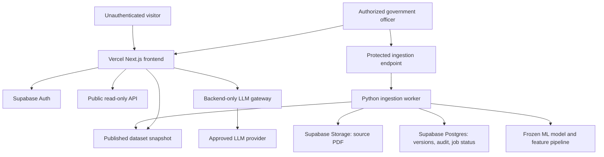

# PRAGATI Deployment, Authorization, and Live Ingestion Plan

Status: **Proposal for approval. No implementation changes are included in this document.**

## 1. Current ingestion error

The error:

```json
{"detail":[{"type":"missing","loc":["query","month_label"],"msg":"Field required"}]}
```

is caused by a request contract mismatch:

- The frontend sends `month_label` inside `multipart/form-data` with the PDF.
- FastAPI currently declares `month_label` as a query parameter.
- FastAPI rejects the request before the PDF parser or scoring pipeline starts.

Approved implementation fix:

```python
from fastapi import Form

def ingest_monthly_report(
    month_label: str = Form(...),
    file: UploadFile = File(...),
):
```

The frontend already sends the correct multipart field. The structured JSON mode can continue using `?month_label=YYYY-MM`, or both endpoints can be standardized on form/body contracts.

## 2. Target deployment architecture



### Recommended hosting split

| Layer | Recommended service | Reason |
|---|---|---|
| Next.js frontend | Vercel | Excellent Next.js deployment and preview workflow |
| Authentication, database, storage, RLS | Supabase | Officer login, roles, audit records, PDF storage, row-level security |
| Python FastAPI API | Render, Railway, Fly.io, or a managed container | Long-running process, pandas, LightGBM, PDF parsing, model files |
| Background ingestion worker | Same container platform with a worker process | PDF parsing and scoring can exceed serverless limits |
| LLM | Approved hosted API or dedicated inference server | Local GGUF cannot run on Vercel; API keys remain server-side |
| Monitoring | Sentry plus platform logs | Error tracking, ingestion failures, security events |

Vercel can host a small Python function, but it is not the preferred production location for this pipeline. PDF parsing, pandas feature refresh, LightGBM scoring, and local GGUF inference need predictable CPU, memory, timeout, and filesystem behavior.

## 3. Public versus protected behavior

### Public unauthenticated users may

- Open the landing page.
- View published portfolio summaries.
- Browse published projects.
- View published risk scores, evidence, alerts, benchmarks, and intervention queues.
- Use the intelligence console only against published, authorized-to-display data.

### Only authorized officers may

- See the ingestion screen.
- Upload PDFs or structured feeds.
- Start an ingestion job.
- Publish a new dataset version.
- View ingestion errors containing source-document details.
- Reprocess, roll back, or supersede a dataset.
- Access audit records and operational metadata.

Authentication alone is not sufficient. The ingestion API must check both:

1. A valid Supabase access token.
2. An officer role or explicit ingestion permission stored in Supabase.

## 4. Supabase security design

### Tables

- `profiles`: user identity and display information.
- `roles`: `viewer`, `officer`, `admin`.
- `user_roles`: user-to-role assignments.
- `ingestion_jobs`: job ID, uploader, month, filename, checksum, status, timestamps, error message.
- `dataset_versions`: immutable version, reporting month, source job, row count, model version, published flag.
- `published_projects`: public read model for the latest approved snapshot.
- `published_risk_assessments`: public risk outputs.
- `published_alerts`: public early warnings.
- `published_interventions`: public priority queue.
- `audit_events`: login, upload, validation, publish, rollback, and failure events.

### Row-level security

- Anonymous users: `SELECT` only on published read-model tables.
- Authenticated viewers: same published `SELECT` access.
- Officers: may create ingestion jobs, but may not directly update published rows.
- Admins: may assign roles, publish or roll back datasets, and manage operational settings.
- Service role: used only by the backend worker, never exposed to the browser.

The browser must never receive the Supabase service-role key.

## 5. Ingestion lifecycle

1. Officer signs in with Supabase Auth.
2. Frontend requests the officer profile and role.
3. Frontend shows the ingestion route only when the role permits it.
4. Frontend uploads the PDF to a protected backend endpoint.
5. Backend validates:
   - access token and officer role;
   - file type and size;
   - PDF magic bytes, not only filename;
   - reporting month format;
   - duplicate checksum;
   - parser format and minimum row count;
   - required project identity fields;
   - data-quality thresholds.
6. Backend stores the original PDF in a private Supabase Storage bucket.
7. Backend creates an `ingestion_jobs` row with `queued` status.
8. Worker parses the report and writes a staging dataset, never directly to public tables.
9. Worker resolves entities, rebuilds features, scores using the frozen model, and derives alerts, trajectories, SHAP evidence, peer context, and interventions.
10. Validation checks compare row counts, month coverage, tier distributions, null rates, and duplicate IDs against thresholds.
11. Officer reviews the validation summary.
12. Admin or delegated officer publishes the staged dataset atomically.
13. Frontend reads the new published version and refreshes all screens.
14. Audit event records uploader, reviewer, model version, dataset version, result, and timestamp.

No partial ingestion should appear in the public dashboard.

## 6. How the frontend updates after ingestion

The publish response should include:

```json
{
  "job_id": "...",
  "dataset_version": "2026-08-v001",
  "status": "published",
  "reporting_month": "2026-08",
  "rows_ingested": 1770,
  "rows_scored": 1660,
  "rows_cold_start": 110,
  "published_at": "..."
}
```

After a successful publish:

- invalidate Next.js data caches;
- update the active dataset version shown in the top bar;
- refresh portfolio summary, projects, risks, alerts, interventions, states, and intelligence context;
- show the ingestion result and any cold-start or excluded-row counts;
- keep the previous published version available for rollback.

The frontend must never infer that a job succeeded merely because the upload request returned HTTP 200. It should poll or subscribe to the job status until `validated`, `published`, or `failed`.

## 7. LLM deployment plan

### Preferred production approach

Use a provider API or dedicated inference server behind the Python backend. The browser sends a question to the backend; the backend retrieves authorized structured facts and calls the LLM with those facts.

Required environment secrets:

```text
LLM_PROVIDER=...
LLM_API_KEY=...
LLM_MODEL=...
SUPABASE_URL=...
SUPABASE_ANON_KEY=...
SUPABASE_SERVICE_ROLE_KEY=...
```

Only the backend receives `LLM_API_KEY` and `SUPABASE_SERVICE_ROLE_KEY`.

### Local Qwen GGUF

The supplied Qwen GGUF is suitable for local development or a dedicated private inference machine. It should not be bundled into Vercel or committed to the repository. If used in production, run it on a private worker with:

- restricted network access;
- explicit memory/CPU sizing;
- request authentication;
- request and response audit logging;
- timeout and concurrency limits.

The LLM remains an explanation and orchestration layer. It must not generate risk scores, override model outputs, invent evidence, or make government decisions.

## 8. Authentication experience

Recommended flow:

- Public routes render for everyone.
- `/login` is available to officers.
- Supabase email/password or organization SSO is preferred over open registration.
- New accounts remain disabled until an admin assigns an officer role.
- Middleware protects `/ingestion` and any future `/admin` route.
- The backend independently verifies the bearer token and role on every protected request.
- Logout clears the Supabase session and returns the user to the public landing page.
- Session expiry shows a clear re-login state instead of silently submitting an unauthenticated upload.

For a government deployment, organization SSO, MFA, short-lived sessions, and an approved domain allowlist are preferable to public self-registration.

## 9. Data and model versioning

Every published snapshot should record:

- reporting month;
- source PDF checksum and storage path;
- parser version;
- feature-builder version;
- model bundle version;
- calibration version;
- row counts and exclusions;
- publication reviewer;
- publication timestamp.

The frozen model must never be overwritten by monthly ingestion. Retraining remains a separate approved operation.

## 10. Implementation phases after approval

### Phase 1: Correctness and local security

- Fix `month_label` as a multipart form field.
- Replace relative paths with configuration-based paths.
- Add job status and staging output.
- Add token verification and officer-role checks.
- Add ingestion validation and duplicate protection.

### Phase 2: Supabase foundation

- Create tables, migrations, RLS policies, private storage bucket, and audit events.
- Add Supabase Auth login/logout.
- Add admin role assignment.
- Add published read-model tables.

### Phase 3: Live pipeline publication

- Move PDF parsing and scoring into a worker job.
- Import the manifest-approved stage outputs into the published schema.
- Publish atomically after validation.
- Add rollback and dataset-version selection.

### Phase 4: Frontend integration

- Protect `/ingestion` in Next.js middleware.
- Add role-aware navigation.
- Add upload job progress, validation report, publish action, and failure recovery.
- Refresh all dashboard modules after publish.
- Remove all remaining static/demo labels and hardcoded landing-page records.

### Phase 5: LLM and operational hardening

- Add provider or private inference gateway.
- Add prompt/tool audit logs and evidence citations.
- Add rate limits, file limits, malware scanning, observability, backups, and incident alerts.
- Run security, authorization, rollback, and data-quality acceptance tests.

## 11. Approval checklist

Before implementation, confirm:

- [ ] Vercel frontend plus separate Python container is acceptable.
- [ ] Supabase is approved for authentication, database, storage, and audit metadata.
- [ ] Officer identity source is email/password, organization SSO, or another approved provider.
- [ ] Officer role assignment will be admin-controlled.
- [ ] Public users may view published project and risk data.
- [ ] PDF source reports may be stored in a private Supabase bucket.
- [ ] A hosted LLM provider is acceptable, or a private Qwen inference machine is required.
- [ ] Monthly ingestion requires human review before publication.
- [ ] Dataset rollback is required.
- [ ] The deployment region, retention period, and government data policy are known.

## 12. Acceptance tests

### Ingestion

- Anonymous upload returns `401` or `403`.
- Authenticated viewer upload returns `403`.
- Authorized officer upload with valid PDF creates a job.
- Missing multipart `month_label` returns a clear validation error.
- Wrong file type, oversized file, duplicate file, malformed PDF, and zero-row parser output are rejected.
- A valid job progresses through `queued`, `processing`, `validated`, and `published`.
- Failed jobs do not change the public dashboard.

### Publication

- Project count, cost totals, risk tiers, alerts, interventions, state summaries, and histories update after publishing.
- The active dataset version changes visibly.
- Previous dataset can be restored.
- Partial or failed output is never publicly visible.

### Authorization

- Public pages work without login.
- Ingestion route redirects unauthenticated users to login.
- Viewer accounts cannot access ingestion APIs directly.
- Admin role changes take effect on the next protected request.
- Service-role credentials never appear in browser network responses.

### LLM

- Questions are answered only from authorized published facts.
- Unsupported claims are marked as unsupported.
- Risk scores and monetary values are not modified by the LLM.
- LLM provider failures fall back to a deterministic evidence response.
- Prompts, tool calls, model version, and response are auditable.
